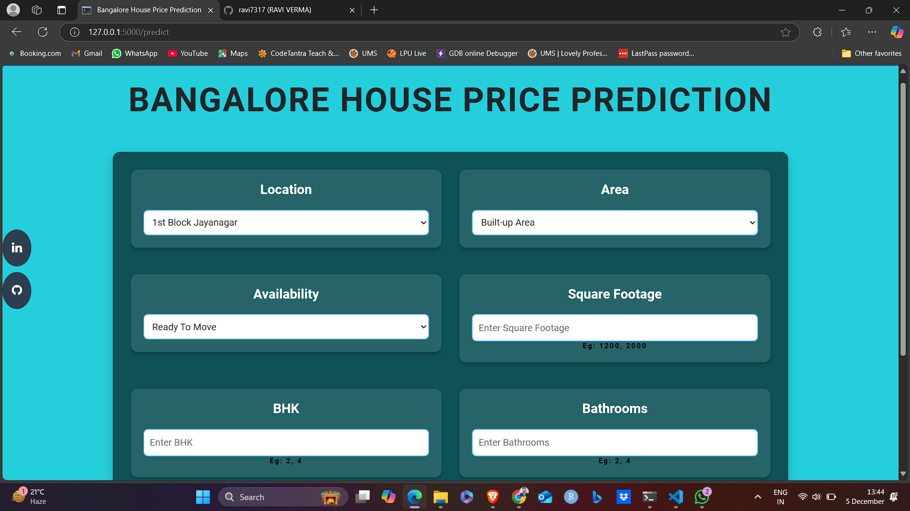

# Bangalore-Housing-Price-Prediction

 

## Project Objectives :
The objective of the project is to create a machine learning model. We are doing a supervised learning and our aim is to do predictive analysis to predict housing price.

## Data Collection :
The dataset is obtained from Kaggle. 

Link: https://www.kaggle.com/datasets/amitabhajoy/bengaluru-house-price-data?resource=download

## Modelling :
The analysis and model creation can be found in the .ipynb file. 

The main packages used are numpy, pandas, matplotlib, seaborn and sklearn.  

## Deployemnt :
The web app has been build using basic HTML, CSS, Javascript, Flask and Herkou.

## Future Scope :
* Use multiple Algorithms
* Optimize Flask app.py
* Update the Front-End 
